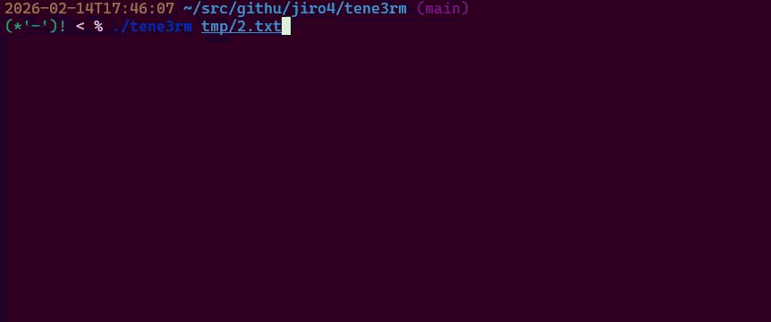

# tene3rm

tene3rm carefully carefully carefully deletes files.



## Overview

Have you ever been frustrated by people who delete files without a second thought?
The `rm` command has an `-i` option, which prompts for confirmation before execution.
When used, it looks like this:

```sh
$ rm -i 1.txt
rm: remove regular empty file '1.txt'? y
```

In some environments, `rm` is aliased to rm `-i` by default to enforce this
safety check.  However, this is easily bypassed. Users can simply pass the `-f`
flag to ignore the prompt, or pipe the `yes` command into it to automate the
`"y"` response.

```sh
$ rm -i -f 1.txt

$ yes | rm -i 2.txt
rm: remove regular empty file '2.txt'?

$
```

I wanted people to be more cautious with file deletion, but since some will
always look for the easy way out, I created this command to force compliance.

This command presents confirmation prompts in various patterns.
It randomly generates challenges that are difficult to automate or bypass with shortcuts-ranging
from standard text input and mental math to TUI (Terminal User Interface) interactions.
Now, users have no choice but to handle deletions manually and intentionally.

_**JUST DO IT!!!**_

## Usage

```sh
tene3rm <files...>
tene3rm -h
```

## Installation

```sh
go install github.com/jiro4989/tene3rm@master
```

## LICENSE

MIT
